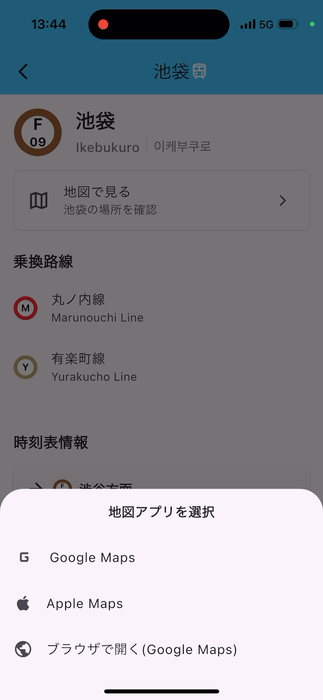

## メトロファインダーの利用方法

### 1. アプリのインストール

- [App Store](https://apps.apple.com/jp/app/%E3%83%A1%E3%83%88%E3%83%AD%E3%83%95%E3%82%A1%E3%82%A4%E3%83%B3%E3%83%80%E3%83%BC/id6738628342)からダウンロードしてください

### 2. アプリの起動

- アプリを起動すると、以下の権限を求めるダイアログが表示されます。
  - 位置情報の利用
  - カメラの利用
- カメラの利用は、メトロファインダーの機能を利用するために必要です。
- 位置情報の利用は、最寄り駅を検索するためにのみ必要であり、必須ではありません。

### 3. 初期画面

- 権限を許可すると、以下の画面が表示されます。

- 画面右下の「検出画面へ」ボタンを押すと、検出画面に移ります。

### 4. 検出画面

- 検出画面では、カメラを利用して、地下鉄の列車のロゴを検出します。
- ロゴが検出されると、ロゴが検出された路線名とともに枠線で囲まれます。
- 枠線内をタップすると、検出結果が表示されます
- ダイアログの「路線情報を見る」ボタンを押すと、路線情報画面に移ります

### 5. 路線情報画面

- 路線情報画面では、検出結果の路線についての情報を表示します。
- 画面上部の「戻る」ボタンを押すと、検出画面に戻ります。
- 駅のリストから駅を選択すると、駅情報画面に移ります。

### 6. 駅情報画面

- 駅情報画面では、検出結果の路線についての情報を表示します。
- 画面上部の「戻る」ボタンを押すと、路線情報画面に戻ります。

### 7. 駅の地図情報の表示

- 駅情報画面で「地図で見る」ボタンを押すと、以下のように地図アプリを選択するダイアログが表示されます。
- 地図アプリを選択すると、地図アプリが起動して、駅の位置が表示されます。

